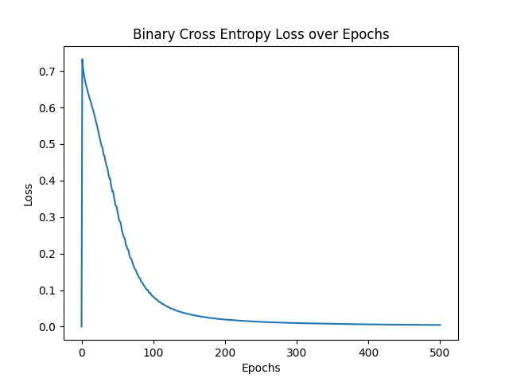

## Neural Network from Scratch

This is a minimal implementation of a fully connected neural network in two languages i.e. Python and C++.

---

## Prequisites

Run:
```bash
pip install -r requirements.txt
```
to install the packages used. 

The cpp version also uses `matplotlibcpp` (lightweight cpp wrapper for python's matplotlib library), so if you wish to view the loss-epoch visualization do make sure to add the header file in `Cpp_NN/Utilities` folder and add python's include and lib flags during compilation.

---

## Structure/Architecture

Following components are made in order to achieve a fully-connected neural network,

Layers/Activations:
- Dense Layer
- ReLU
- Sigmoid

Losses:
- Mean Squared Error
- Binary Cross Entropy 

---

## Why Two Languages?

Python is a high-level language that maximizes readability and modularity, so it's easier to translate a mathematical model into python first, whereas Cpp is a mid-level language that is blazingly faster than python. So, I wanted to learn architecture of Neural Network in both ways, intuition-majorly and efficient-implementation-majorly. The cpp version doesn't even use Utility libraries like Jaxtype or Eigen (numpy alternatives for Cpp), I made my own matrix operation class with static function.

---

## Math involved

You can digest most of the neural network intuition if you know basic linear algebra and multi-variable calculus. Though knowing Functional Analysis, Numerical Analysis, and Mathematical Optimisation can help you appreciate the "why" behind the way nerual networks work. I won't go over the specific gradient derivation, you can already find them in alot of places on internet and in books. 

---

## Evaluation

Following are loss-epochs graph of training history.

- Python version (XNOR)
  


- Cpp version (XOR)



---


